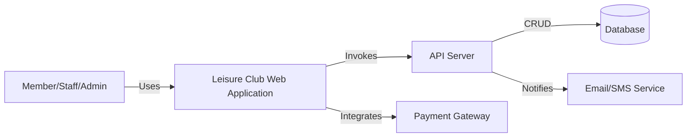
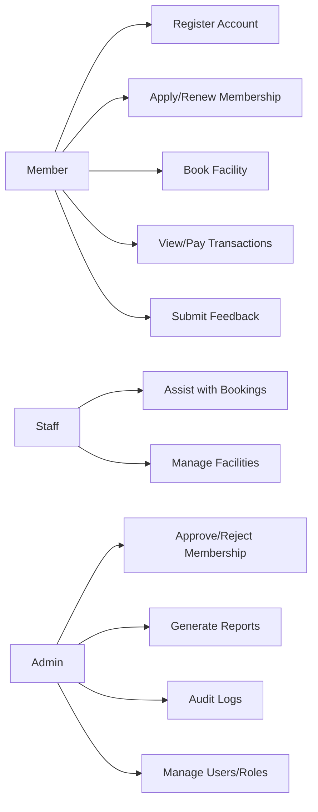
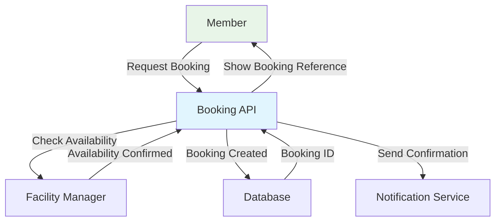

# Software Requirements Specification (SRS) for Leisure Club Membership, Facilities, and Booking Web Application

---

## Introduction

### Purpose

The purpose of this document is to define a comprehensive set of requirements and architectural guidelines for developing a robust web application tailored to the management needs of a leisure club. This includes membership enrollment and management, facilities scheduling and booking, transaction history records, and associated administrative oversight. Additionally, the SRS addresses non-functional requirements such as security, scalability, and usability, in alignment with established industry standards like ISO/IEC/IEEE 29148:2018. The intended audience includes software engineers, project managers, quality assurance personnel, and stakeholders responsible for the successful delivery and ongoing operation of the software.

### Scope

This SRS outlines the development of a web application that will serve as the digital backbone for a leisure club’s daily operations. It encompasses all major user roles, from club members to staff and administrators, and covers the full lifecycle of membership management, the reservation and usage of club facilities (e.g., sports courts, event spaces, meeting rooms), as well as comprehensive tracking of financial transactions and facility usage histories. The application is to include an integrated database, audit trail features, and role-based access controls to ensure data integrity, legal compliance, and operational efficiency.

---

## System Overview

### Product Perspective

The application will function as a centralized web-based platform accessible via modern browsers and mobile devices. It will provide distinct interfaces for club members, staff, and administrators, ensuring tailored access to features and data per user role. Integration points include third-party payment gateways, email/SMS notifications for club communication, and potential interfaces for access control hardware (e.g., RFID, biometric readers) which are typical in modern club management settings.

### Objectives and Goals

- Streamline and automate the club’s membership processes and facility bookings, eliminating redundant manual work.
- Enable real-time booking management, notifications, and collaborative administration.
- Securely retain historical data related to memberships, bookings, and transactions, supporting audit and compliance needs.
- Provide a scalable foundation as club membership and facility offerings increase.

---

## System Architecture

### High-Level Architecture

The system follows a modular, three-tier architecture comprised of:

1. **Presentation Layer** (Frontend): Responsive web interface built with modern frameworks (e.g., React), accessible on multiple devices.
2. **Application Layer** (Backend/API): Modular business logic and RESTful API services, possibly Node.js or Python-based.
3. **Data Layer**: Relational database (PostgreSQL/MySQL) managing persistent membership, booking, and transaction history data.

**Supporting components** include authentication/authorization services, notification systems, and monitoring/logging modules for auditing and maintenance.

---

### System Context Diagram

This diagram conceptualizes the relationships among users, the web frontend, the API backend, the persistent datastore, and external integrations like payments and notifications, providing a high-level context for stakeholders and designers.

---

### C4 Model Representation

**Level 1: Context**

- Actors: Members, Staff, Administrators.
- System: Web app for membership, facility, and booking management.
- External Systems: Payment Gateway, Email/SMS, Access Control Devices.

**Level 2: Containers**

- Web UI: Frontend SPA or multipage app.
- REST API: Serves as the gateway for all business logic.
- Database: Relational DB for all critical, structured data.
- Authentication Service: Manages user accounts, logins, roles.

**Level 3: Components**

- Membership Module
- Facilities/Booking Module
- Transaction Logger
- Audit Trail Engine
- Notification Service

**Level 4: Code/Entities**

- Data models, DAO/repositories, controller endpoints, UI components.

Such layers ensure flexibility and maintainability and reflect industry best practices for scalable, auditable web applications.

---

## Functional Requirements

### Overview

Functional requirements delineate the specific behaviors, transactions, and processes the software must fulfill for all user categories.

#### User Administration

- Registration: Users can create accounts and complete profile information.
- Authentication: Secure login process; support for password reset and multi-factor authentication for sensitive roles.
- Profile Management: Users can edit personal data, manage contact and payment information, view activity and transaction histories.
- Role Assignment: System supports varied user roles (Admin, Staff, Member, Guest) with granular privilege settings.

#### Membership Management

- Members can apply for, renew, or cancel memberships online.
- Membership status approvals or rejections by administrators.
- Automated status update notifications.
- Support for tiered membership plans and special offers.
- Members can view club policies, terms, and facility access guidelines.

#### Facilities and Booking Management

- Members can view available facilities, book time slots, and receive real-time availability feedback.
- System must prevent double-booking or conflicts in facility schedules.
- Booking confirmation emails/SMS and automated reminders.
- Facility administrators can update availability, schedule maintenance, and override bookings if necessary.
- Members and staff can manage requests for recurring bookings, group reservations, and special events.

#### Transaction Management

- All financial transactions (membership fees, facility bookings, refunds) are logged persistently.
- Support for payment, refund, and cancellation flows in line with club policies.
- Integration with major payment gateways (credit/debit card, PayPal, bank transfer).
- Users can access their transaction histories and receipts online.
- Admins can generate and export financial reports, including but not limited to: monthly revenue summaries, facility utilization statistics, and membership growth trends.

#### Audit Log and History

- Complete record-keeping of all membership changes, bookings, and critical actions for legal compliance and traceability.
- Transaction history for auditing purposes and dispute resolution.
- Tamper-proof storage of logs; logs must be available for administrator review and export.

#### Communication Management

- Automated notifications for bookings, payment due dates, membership expiries, and policy changes.
- In-app messaging or announcement board for real-time communication.
- Optional newsletter subscriptions and feedback/review collection modules.

#### Feedback and Support

- Facility for members to submit feedback, rate facilities, and report issues.
- Staff/admins have tools to monitor, respond to, and resolve support tickets.

---

### Use Case Summary Table

| Use Case                | Actor     | Trigger                     | Description                                                            |
| ----------------------- | --------- | --------------------------- | ---------------------------------------------------------------------- |
| Member Registration     | Member    | User submits registration   | Validates input, creates member profile, sends email confirmation      |
| Facility Booking        | Member    | Booking request             | Checks for conflicts, persists booking, sends confirmation/reminder    |
| Approve Membership      | Admin     | Member applies              | Reviews application, approves/rejects, updates status/notifications    |
| Check-in/Out            | Staff     | Member arrives/leaves       | Records access, updates history, potentially integrates with hardware  |
| Transaction Recording   | All Roles | Payment/refund/cancellation | Records in transaction/audit tables, updates status, sends receipt     |
| Generate Report         | Admin     | On demand                   | Exports booking/transaction/membership reports as needed               |
| Feedback Submission     | Member    | User provides feedback      | Stores feedback, makes it visible to staff for response and QA reviews |

Each use case is covered by domain-specific modules that account for exceptional flows, validation requirements, and security constraints.

---

#### Example Use Case Diagrams

**High-Level Use Case Diagram :**

**This visualizes the major interactions and highlights the role-based access to key system features in a way that is accessible to both technical and non-technical stakeholders.**

---

## Non-Functional Requirements

Non-functional requirements (NFRs), also called software quality attributes, specify how the system should perform. These are critical to project success, especially for public-facing, high-availability web applications such as club management systems.

---

### Performance

- **Responsiveness:** Average response time for user actions <2 seconds; 95th percentile under 3 seconds even at peak load.
- **Concurrency:** Support at least 5,000 concurrent sessions (scalable beyond) without performance degradation.
- **Throughput:** System capable of processing no less than 100 booking transactions per minute during normal operations.

### Scalability

- **Horizontal Scalability:** System infrastructure (web servers, APIs, databases) must support easy horizontal scaling—whether via load balancers (stateless API servers) or database sharding as needed.
- **Data Volume:** Database design accommodates anticipated user growth (e.g., 20,000+ members and 1M+ transactions/year) without schema or performance issues.

### Reliability and Availability

- **Uptime:** System operates 99.9% of the time, not counting scheduled maintenance windows.
- **Recovery:** Support automated full backups daily with point-in-time recovery (RPO ≤1 hour, RTO ≤4 hours).
- **Fault Tolerance:** Graceful, actionable error handling; component failures isolated with no systemic propagation.

### Security

- **Encryption:** All sensitive data in storage is encrypted with AES-256; all transport is secured with TLS 1.2 or above.
- **Access Control:** Enforce role-based mechanisms with principle of least privilege; regular revalidation of roles and access.
- **Vulnerability Protection:** OWASP Top 10 risks must be mitigated—regular code audits and use of up-to-date libraries/frameworks.
- **Authentication:** Multi-factor authentication (MFA) for admin/staff; complex password policies.
- **Auditability:** Immutable audit records for all critical changes to user, booking, or financial data.

### Usability

- **Intuitive UI:** Minimal training required for members; all error messages should be actionable and nontechnical.
- **Accessibility:** Compliance with WCAG 2.1 AA to ensure access for users with disabilities.
- **User Support:** On-page contextual help and searchable documentation; support requests routed efficiently.

### Maintainability

- **Codebase:** Code must be modular, commented, and adhere to industry best practices.
- **Extensibility:** System is structured for easy addition of new club features, facilities, or modules with minimal regression risk.
- **Monitoring:** Automated error logging, health checks, and diagnostics for timely issue identification.

### Compliance

- **Data Protection:** GDPR/CCPA compliant—right to access, delete, or modify personal data; explicit consent and data minimization enforced.
- **Financial Reporting:** All financial and transaction data must be exportable in standard formats for statutory accounting.

---

#### Example Non-Functional Requirements Table

| Category     | Requirement                                                          | Acceptance Criteria                                       |
| ------------ | -------------------------------------------------------------------- | --------------------------------------------------------- |
| Performance  | Bookings/queries respond within 2s for 95% of actions (5000+ users)  | Performance tests pass at simulated peak load             |
| Security     | All transport encrypted via TLS; AES-256 at rest                     | Penetration tests and vulnerability scans show compliance |
| Usability    | 95% user satisfaction in user surveys; error rates <2% for key tasks | Usability study results, error and usage logging metrics  |
| Scalability  | System supports load surge up to 10,000 users seamlessly             | Load tests with spike traffic; auto-scale infra review    |
| Availability | 99.9% uptime (monthly); no single outage >15 minutes                 | Monitoring tools and incident postmortems                 |

---

## User Roles and Permissions

A robust leisure club management system must clearly define user roles—each with distinct permissions. Leveraging Role-Based Access Control (RBAC) ensures both security and operational clarity.

---

### Role Matrix Overview

| Role   | Membership Management | Booking Management | Transaction History | User/Admin Audit | Facility Admin | Configuration | View Reports | Support/Feedback |
| ------ | --------------------- | ------------------ | ------------------- | ---------------- | -------------- | ------------- | ------------ | ---------------- |
| Member | View/modify own       | Book/cancel/modify | View own            | No               | No             | No            | No           | Submit           |
| Staff  | View members          | Manage bookings    | Access relevant     | Partial          | Schedule/show  | Limited       | Some         | Respond/Handle   |
| Admin  | Full                  | Full               | Full                | Full             | Full           | Yes           | Yes          | Full             |
| Guest  | Apply/register        | Browse only        | None                | None             | None           | None          | None         | Limited info     |

**Explanation:**

- **Member:** Can self-manage their account, bookings, and view their own transactions and history. Cannot modify or access other members’ data.
- **Staff:** Assists with booking management, member registration processing, and possibly resolves support issues. Access is limited compared to administrators, especially in sensitive data areas.
- **Admin:** Full system access, including all data export/import, logs, configurations, and audit capabilities. Tasked with user and facility management, reporting, compliance oversight, and system-level support.
- **Guest:** Can browse publicly available content such as facility descriptions and membership tier information. Guests can also initiate the registration process to apply for membership.

Periodic review and audit of these roles ensure minimal risks of privilege escalation or data leakage. Admins should have the ability to temporarily elevate staff access as necessary and must record all such changes in the audit trail.

---

## Data Flow and System Processes

Capturing the flow of data is critical for ensuring correctness and preventing gaps in security and consistency. Modern best practice is to create both high-level and detailed data flow diagrams (DFDs) during the design phase.

---

### Example Data Flow: Booking Process (Mermaid Syntax)

**Flow Description:**

1. Member initiates a booking request.
2. System checks real-time facility availability (avoids double-booking).
3. If available, booking is written to database and member receives confirmation.
4. If unavailable, member is prompted to select alternative slots.

---

### Audit Trail Flow

1. All booking, membership, or transaction changes trigger the audit logger.
2. Relevant details (user, timestamp, action, prior state, new state) are appended to an immutable audit log.
3. Admins can query or export logs for inspection or compliance reporting.

---

### External Integrations

- **Payment Gateway:** Secure API-based transaction processing with real-time feedback to booking engine.
- **Email/SMS:** Triggers for membership changes, booking reminders, and error/status notifications.
- **Access Hardware:** Integration with RFID/biometric devices for tracking check-in/out and preventing unauthorized facility usage is required. The system must follow secure API practices and data privacy regulations.

---

## Database Design and Schema

A solid schema is critical for data integrity, performance, and future extensibility. The design must cater to relational queries and transactional consistency, especially for bookings and financial operations.

### Key Entity Tables

| Table             | Purpose                          | Key Fields                                                |
| ----------------- | -------------------------------- | --------------------------------------------------------- |
| Users             | Store member/staff/admin details | user_id, name, email, role, status                        |
| Memberships       | Track memberships and types      | membership_id, user_id, type, status, start/end           |
| Facilities        | Catalog facilities for booking   | facility_id, name, type, status, capacity, schedule       |
| Bookings          | Store reservations and status    | booking_id, user_id, facility_id, datetime, status        |
| Transactions      | Payment and refund data          | transaction_id, user_id, amount, type, booking_id         |
| Audit_Log         | Immutable log of actions         | log_id, user_id, action, entity, old/new value, timestamp |
| Feedback/Reviews  | User feedback and reviews        | feedback_id, user_id, target, rating, comments, timestamp |
| Roles/Permissions | Access management                | role_id, permission, description                          |

**Relationships:**

- Users have multiple memberships over time.
- Facilities may have multiple bookings, but bookings must not overlap for a given facility/time.
- Transactions are linked to bookings and users.
- All key actions are logged in Audit_Log for traceability.
- Roles/permissions tables support RBAC logic with mapping to users.

### Transaction/Audit Trail Design

There are three main patterns found in modern database audit logging:

- **Row Versioning:** Adds version and metadata to each change, but complicates queries against the latest active data.
- **Shadow (History) Tables:** On every change (insert, update, delete), a corresponding record is added to a log/history table. Triggers or application logic ensure post-change snapshots are stored, along with actor, timestamp, and operation type.
- **Generic Audit Tables:** Separate log tables capturing the operation type, affected table, rows, and old/new field values. This is most flexible and frequently preferred for operational systems needing compliance logging but not continuous versioning.

For leisure club management, shadow tables or generic logs with triggers on key transactional tables (e.g., Bookings, Transactions, Memberships) provide the necessary audit granularity and compliance.

---

## Security Considerations

Security is a non-negotiable priority in systems managing personal and financial data. This section outlines requirements and best practices derived from OWASP, ISO, and industry case studies regarding club management and booking platforms.

---

### Core Security Requirements

- **Authentication:** Strong, multi-factor authentication for staff/admins. Passwords stored only as salted hashes (e.g., bcrypt, Argon2).
- **Authorization:** Strict enforcement of RBAC for all application features. No escalation of privileges outside explicit, logged approval.
- **Input Validation:** All user input is sanitized and validated both client- and server-side. No SQL injection or XSS vulnerabilities.
- **Session Management:** Secure, short-lived session tokens. Automatic timeout and forced logouts on inactivity or detected credential reuse.

### Data Protection

- **Data in Transit:** TLS (minimum 1.2) on all client–server and server–server communications.
- **Data at Rest:** All PII and sensitive data encrypted using AES-256 or equivalent.
- **Data Minimization:** Only necessary data is collected and stored, in compliance with privacy laws.

### Logging, Monitoring, and Alerts

- **Audit Trail:** Immutable, tamper-proof log of all critical actions (membership changes, bookings, payments, access elevation).
- **Monitoring:** Real-time monitoring of abnormal access patterns, failed logins, or attempted breaches.
- **Incident Response:** Defined escalation procedures in case of breach, including notification to affected users as required by law.

### OWASP Top 10 Alignment

The application must specifically address and mitigate these critical vulnerabilities:

- **Broken Access Control:** No direct or indirect privilege escalation paths; all access control decisions enforced server-side.
- **Cryptographic Failures:** Strong, up-to-date cryptography for all data and communications.
- **Injection (SQL, XSS):** Strict use of ORM and sanitization libraries; no dynamic SQL construction based on user input.
- **Security Misconfiguration:** No unused APIs/services, no verbose error messages disclosing sensitive info.
- **Outdated Components:** Dependency management/monitoring for timely application of security patches and updates.

Regular vulnerability scans and penetration tests should be part of ongoing maintenance, with findings and remediation steps subject to internal audit.

---

## Usability and UI/UX Guidelines

For member portals and booking interfaces, usability has a direct impact on member satisfaction and operational efficiency.

Features and recommendations include:

- **Personalized Dashboards:** Quick access to account status, upcoming bookings, recent payments. Welcome greetings, profile photo, and onboarding tips for new members.
- **Curated Quick Links:** Prominent links to manage bookings, payments, membership status, policies, and help.
- **Accessibility:** Designs must comply with accessibility standards (WCAG 2.1 AA)—sufficient color contrast, keyboard navigation, screen-reader compatibility.
- **Consistent Navigation:** Clear, persistent navigation menus, breadcrumbs, and on-page help for critical workflows.
- **Instant Feedback:** Immediate and clear feedback for all actions, such as successful submissions, errors, or status updates.
- **Mobile Responsiveness:** Full support and optimized layouts for smartphones and tablets.
- **Error Prevention and Recovery:** Inline form validation and error correction hints. Clear paths for undoing mistaken actions.
- **Help and Documentation:** Contextual documentation, help links, and live support/contact options available on every major workflow page.
- **Onboarding:** New user orientation features—for example, "Start Here" guides and FAQ overlays—to minimize confusion and initial support requests.

Standard UI/UX heuristics (e.g., Nielsen’s 10 rules of thumb) should be applied at each stage of the design iteration for optimal learnability and engagement.

---

## Scalability and Deployment

Modern best practices for web application scalability must be embedded in the architecture from the start:

- **Stateless API Servers:** All business logic endpoints should be stateless and horizontally scalable behind a load balancer.
- **Database Sharding/Partitioning:** Techniques such as sharding or read replica databases should be supported as the number of records grows.
- **Cloud-Native Design:** Implementation should support containerization (Docker/Kubernetes) and cloud-managed services (AWS, Azure, GCP) for deployment flexibility and disaster recovery.
- **CI/CD Integration:** Automated pipeline for building, testing, and deploying, with staged environments for development, QA, and production.
- **Monitoring and Alerting:** Integrated monitoring dashboard and proactive alerting for errors, performance bottlenecks, and anomalous activity.

---
---

## Data Migration

A seamless transition from any existing systems to the new leisure club management application is critical. This section outlines the strategy for data migration.

- **Data Analysis:** An initial analysis of existing data sources (e.g., spreadsheets, legacy databases) will be conducted to identify data to be migrated, including member profiles, booking history, and financial records.
- **Migration Strategy:** A phased migration approach is recommended. The migration will be scripted and tested thoroughly in a staging environment before being executed on the production system.
- **Data Validation:** Post-migration, a validation process will be initiated to ensure data integrity and accuracy. This includes checks for data completeness, correctness, and consistency.
- **Downtime:** The migration will be scheduled during a period of low activity to minimize disruption to club operations. A temporary service freeze may be required.

## Example References and Case Studies

Numerous commercial and open-source solutions exist for club and booking management, offering key lessons and benchmarks for feature and architecture planning:

- **eCube Club Management (India):** Fully automated, integrated cross-platform club management for >6,000 members; features include biometric/RFID integration, personalized dashboards, facility booking, and robust reporting.
- **Mediasoft’s Club Management ERP (Bangladesh):** ERP with mobile/web integration tracking memberships, event bookings, inventory; improved member experiences and operational transparency highlighted as key benefits.
- **Zealous Club Management System (Australia):** Digital transition from paper/manual to central web platform, demonstrated streamlined registration and billing, member feedback modules, and admin panel for advanced reporting and auditing.
- **Open-Source Examples:** GitHub repositories implementing SRS for gyms, libraries, room/booking management systems—see student_gym, requirement-analysis, and others for real SRS and diagram artifacts.

---

## Diagrams, Documentation, and Tooling

- **Mermaid and PlantUML:** For SRS documentation, using diagram-as-code tools (Mermaid, PlantUML, MarkSpecs) ensures architectural drawings remain version-controlled and easily updated.
- **C4 Model:** Adopt the C4 model for system, container, and component diagrams, ensuring documentation remains relevant and synchronized with the evolving codebase.

---

## Summary and Recommendations

In summary, a successful leisure club management and booking platform must:

- Adhere to international SRS/requirements/documentation standards for clarity and traceability.
- Support robust handling of memberships, booking flow, and transaction/audit histories—implementing strong role-based security and audit mechanics throughout.
- Provide an intuitive, responsive, and accessible member interface that aligns with modern web/app usability expectations.
- Offer solid scalability and resilience via modular software architecture, cloud-native tools, and advanced database sharding and audit logging practices.
- Remain tightly coupled with security best practices and compliance requirements from the ground up, including continuous testing and monitoring against evolving threats.

Reference implementations and real-world case studies highlight that platform success correlates with deep integration between booking, finance, feedback, and audit features—all tightly governed by secure and flexible RBAC. By implementing this comprehensive SRS, club owners, developers, and users alike can expect a scalable, secure, user-centered solution positioned for long-term operational excellence and growth.

---

A comprehensive Software Requirements Specification (SRS) for a web application that manages leisure club memberships, facilities, and bookings. This will include everything from functional and non-functional requirements to system architecture and database design.
